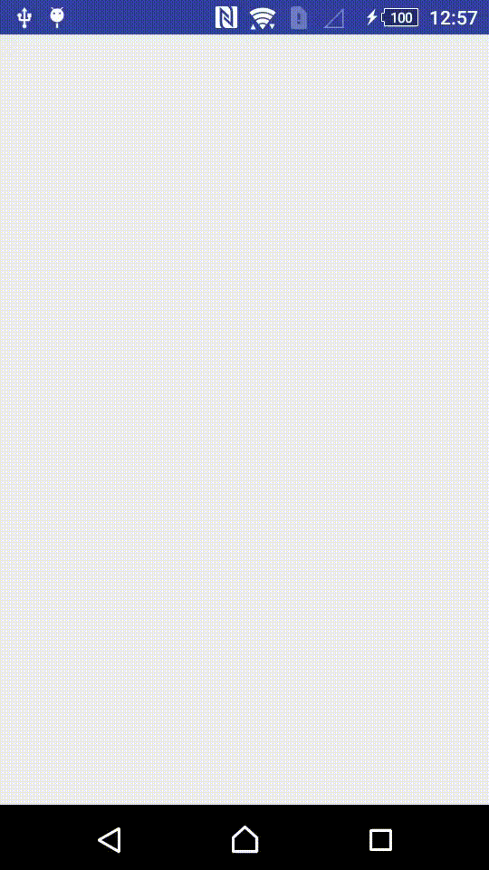

# progress-image-view-android
Simple progress with ImageView android

## Demo
<p align="center">
  
</p>

## Install 
Add the dependecy

```gradle
allprojects {
  repositories {
    ...
    maven { url 'https://jitpack.io' }
  }
}
dependencies {
  compile 'com.github.safetysystemtechnology:progress-image-view-android:v1.0'
}
  
```


### Add permissions in your androidmanifest.xml
```xml
<uses-permission android:name="android.permission.INTERNET" />
```

## Usage

```xml
<safety.com.br.progressimageview.ProgressImageView
        android:layout_width="120dp"
        android:layout_height="120dp"
        android:id="@+id/progress_image_view" />

```

```java

private ProgressImageView progressImageView;

progressImageView = (ProgressImageView) findViewById(R.id.progress_image_view);

//Start animation of loading
progressImageView.showLoading();

```
By default the animation of progress is auto hide.
if you prefer, you can set auto hide `false`
```java
progressImageView.showLoading().withAutoHide(false);
```
but to stop the animation you should invoke method `hideLoading`
```java
 progressImageView.hideLoading();
```

You can set the animation color and set the border size of animation
```java
progressImageView.withBorderColor(Color.RED).withBorderSize(10);
```
and set custom offSet 
```java
progressImageView.withOffset(10);
```
## Acknowledgment
         
 * [Leandro Ferreira](https://github.com/leandroBorgesFerreira)


## License
    The MIT License (MIT)

    Copyright (c) Safety System Technology

    Permission is hereby granted, free of charge, to any person obtaining a 
    copy of this software and associated documentation files (the "Software"), 
    to deal in the Software without restriction, including without limitation 
    the rights to use, copy, modify, merge, publish, distribute, sublicense, 
    and/or sell copies of the Software, and to permit persons to whom the Software is 
    furnished to do so, subject to the following conditions:

    The above copyright notice and this permission notice shall be included 
    in all copies or substantial portions of the Software.

    THE SOFTWARE IS PROVIDED "AS IS", WITHOUT WARRANTY OF ANY KIND, EXPRESS OR IMPLIED, 
    INCLUDING BUT NOT LIMITED TO THE WARRANTIES OF MERCHANTABILITY, FITNESS FOR A PARTICULAR 
    PURPOSE AND NONINFRINGEMENT. IN NO EVENT SHALL THE AUTHORS OR COPYRIGHT HOLDERS BE LIABLE 
    FOR ANY CLAIM, DAMAGES OR OTHER LIABILITY, WHETHER IN AN ACTION OF CONTRACT, TORT OR OTHERWISE,
    ARISING FROM, OUT OF OR IN CONNECTION WITH THE SOFTWARE OR THE USE OR OTHER DEALINGS IN THE SOFTWARE.
